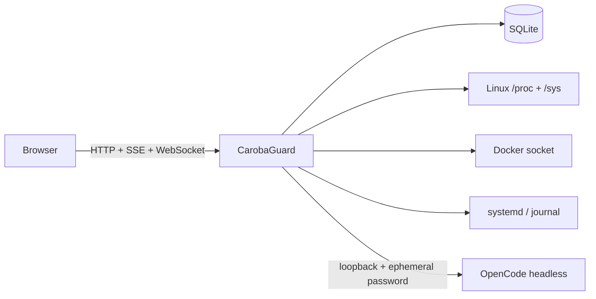

# CarobaGuard

> A lightweight, technical Linux control panel with an OpenCode-powered sysadmin copilot.

[Português](README.md) · [Architecture](docs/architecture.md) · [Threat model](docs/threat-model.md) · [AGPL-3.0 License](LICENSE)

[](https://github.com/SamuelCaroba/carobaguard/actions/workflows/ci.yml)
[](LICENSE)
[](Cargo.toml)

CarobaGuard combines telemetry, Docker, systemd, logs, a terminal, projects, and diagnostics in one Rust daemon. Its frontend is embedded in the binary and SQLite is the default store: Node.js, Redis, Prometheus, Grafana, and Docker are not mandatory production dependencies.

Its defining feature is the on-demand, headless **OpenCode** integration. The server supplies selected context to the agent, presents questions and approval requests inside the panel, and records relevant operations in the Audit Log.

> **Project status:** usable alpha, not yet recommended for direct public-internet exposure. Current development and real-world validation primarily target CachyOS/Arch Linux x86_64.

## What works today

- native `/proc` and `/sys` telemetry for CPU, cores, frequency, load, memory, swap, storage, I/O, network, uptime, processes, and temperatures;
- SSE dashboard, bounded history, and Performance Mode;
- CarobaGuard self-overhead for CPU, RAM, disk, network, and database writes;
- Argon2 authentication, sessions, CSRF, login throttling, and backend RBAC;
- direct Docker Unix-socket integration for containers, inspect, metrics, logs, and lifecycle operations;
- systemd inventory, status, journal, and lifecycle operations;
- bounded Docker/journal log streaming with backpressure;
- authenticated, same-origin WebSocket PTY terminal;
- read-only Server Doctor findings with severity and confidence;
- root-restricted local Projects, safe Git status, and project context;
- loopback-only OpenCode headless lifecycle with sleeping/start/stop and persistent sessions;
- bounded and redacting Context Engine;
- Read Only, Require Approval, and admin-confirmed Unrestricted modes;
- interactive OpenCode questions and approval decisions inside the chat;
- mandatory Audit Log for mutations, decisions, and agent tools.

## Architecture in 30 seconds



One native process serves the API and frontend. OpenCode starts only when needed and returns to approximately zero CarobaGuard-managed RAM after it stops.

## Quick installation

### Requirements

- Linux with systemd, Git, and a C compiler;
- Rust 1.85 or newer;
- OpenCode is optional, but required for AI features.

Ubuntu/Debian:

```bash
sudo apt update
sudo apt install -y build-essential curl git pkg-config
curl --proto '=https' --tlsv1.2 -sSf https://sh.rustup.rs | sh
```

Arch/CachyOS:

```bash
sudo pacman -S --needed base-devel curl git rust
```

Install CarobaGuard for the current user:

```bash
git clone https://github.com/SamuelCaroba/carobaguard.git
cd carobaguard
./scripts/install-user.sh
```

The installer builds a locked release, installs it at `~/.local/bin/carobaguard`, creates a private environment file and a systemd user service, starts the daemon, and prints a password only for a new installation.

Open <http://127.0.0.1:8090>. Follow logs with:

```bash
journalctl --user -u carobaguard -f
```

If no user systemd session is available, the installer preserves the installation and prints a manual start command.

### Install OpenCode

Use the official installer and configure a model provider **as the same user that runs CarobaGuard**:

```bash
curl -fsSL https://opencode.ai/install | bash
opencode auth login
systemctl --user restart carobaguard
```

See the [official OpenCode documentation](https://opencode.ai/docs/) for other methods and providers. CarobaGuard never exposes the internal headless port or password to the browser.

## Secure remote access

CarobaGuard binds only to `127.0.0.1` by default. An SSH tunnel is the simplest VPS access method:

```bash
ssh -L 8090:127.0.0.1:8090 user@your-server
```

Then open <http://127.0.0.1:8090> locally. For permanent access, prefer Tailscale/VPN or an HTTPS reverse proxy. Set `CAROBAGUARD_COOKIE_SECURE=true` behind HTTPS. Do not expose the port directly to the internet during alpha.

## AI permission modes

| Mode | Behavior |
| --- | --- |
| **Read Only** | Default. Denies mutating tools while allowing bounded inspection. |
| **Require Approval** | Pauses mutating operations until an operator approves or rejects them. |
| **Unrestricted** | Removes per-action approval after explicit Admin confirmation. |

Unrestricted does not bypass authentication, RBAC, the Audit Log, or Linux permissions. It gives the agent exactly the power already held by the daemon account. Use a dedicated account or the per-user installer and grant groups/polkit rights only when required.

## Configuration

The installer writes `~/.config/carobaguard/carobaguard.env`. Restart with `systemctl --user restart carobaguard` after editing it.

| Variable | Default | Purpose |
| --- | --- | --- |
| `CAROBAGUARD_HOST` | `127.0.0.1` | Listen address |
| `CAROBAGUARD_PORT` | `8090` | Dedicated HTTP port |
| `CAROBAGUARD_DATA_DIR` | `$XDG_DATA_HOME/carobaguard` | SQLite and state |
| `CAROBAGUARD_ADMIN_USERNAME` | `admin` | First-boot admin |
| `CAROBAGUARD_ADMIN_PASSWORD` | generated | Initial password, 12+ characters |
| `CAROBAGUARD_COOKIE_SECURE` | `false` | Require HTTPS-only cookies |
| `CAROBAGUARD_SESSION_TTL_SECONDS` | `43200` | Web session lifetime |
| `CAROBAGUARD_PROJECT_ROOTS` | `$HOME` | Colon-separated allowed project roots |
| `CAROBAGUARD_TERMINAL_MAX_SESSIONS` | `4` | Concurrent PTYs |
| `CAROBAGUARD_TERMINAL_IDLE_TIMEOUT_SECONDS` | `900` | Idle terminal timeout |
| `CAROBAGUARD_TERMINAL_MAX_DURATION_SECONDS` | `14400` | Absolute terminal lifetime |
| `CAROBAGUARD_LOG_MAX_STREAMS` | `8` | Concurrent log streams |

Docker requires access to `/var/run/docker.sock`. systemd operations follow polkit and the real privileges of the service user; CarobaGuard does not manufacture privilege elevation.

## Update or uninstall

```bash
git pull --ff-only
./scripts/install-user.sh
```

Remove the service and binary while preserving data:

```bash
./scripts/uninstall-user.sh
```

Use `./scripts/uninstall-user.sh --purge` only when you also want to delete local configuration and the SQLite database.

## Run without installing

```bash
export CAROBAGUARD_DATA_DIR="$PWD/data"
export CAROBAGUARD_ADMIN_PASSWORD='a-unique-password-with-at-least-12-characters'
cargo run --release
```

## Development

```bash
cargo fmt --all -- --check
cargo check
cargo clippy --all-targets --all-features -- -D warnings
cargo test
node --check web/app.js
git diff --check
```

Read the [architecture](docs/architecture.md), [OpenCode integration contract](docs/opencode-integration.md), and [threat model](docs/threat-model.md) before changing authentication, child processes, the terminal, or AI permissions.

Contributions and security reports are welcome. Never include tokens, SQLite databases, private logs, or project contents in public issues.

## License

CarobaGuard is free software licensed under [GNU AGPL-3.0-only](LICENSE).
