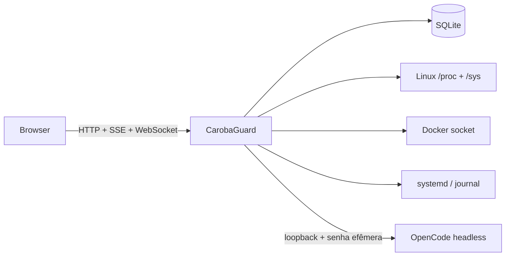

# CarobaGuard

> Um painel Linux leve, técnico e com um copiloto de sysadmin baseado no OpenCode.

[English](README.en.md) · [Arquitetura](docs/architecture.md) · [Threat model](docs/threat-model.md) · [Licença AGPL-3.0](LICENSE)

[](https://github.com/SamuelCaroba/carobaguard/actions/workflows/ci.yml)
[](LICENSE)
[](Cargo.toml)

CarobaGuard reúne telemetria, Docker, systemd, logs, terminal, projetos e diagnóstico em um único daemon Rust. O frontend está embutido no binário e o armazenamento padrão é SQLite: não há Node.js, Redis, Prometheus, Grafana ou Docker como dependências obrigatórias em produção.

O diferencial é a integração headless e sob demanda com o **OpenCode**. O servidor entrega contexto selecionado ao agente, apresenta perguntas e pedidos de aprovação dentro do painel e registra as operações no Audit Log.

> **Estado do projeto:** alpha utilizável, ainda não recomendado para exposição direta à internet. O desenvolvimento e os testes reais atuais são feitos principalmente em CachyOS/Arch Linux x86_64.

## O que já funciona

- telemetria Linux via `/proc` e `/sys`: CPU, cores, frequência, load, RAM, swap, disco, I/O, rede, uptime, processos e temperaturas;
- dashboard em SSE, histórico com retenção e Performance Mode;
- consumo do próprio CarobaGuard: CPU, RAM, disco, rede e escritas no banco;
- autenticação Argon2, sessões, CSRF, limitação de login e RBAC no backend;
- Docker via socket Unix: containers, inspect, métricas, logs e start/stop/restart;
- systemd: inventário, estado, logs e operações de lifecycle;
- visualizador de logs Docker/journal com streaming limitado e backpressure;
- terminal PTY via WebSocket autenticado e same-origin;
- Server Doctor read-only com severidade e confiança;
- Projects com limites por raiz, estado Git seguro e contexto específico;
- OpenCode headless em loopback, lifecycle sleeping/start/stop e sessões persistidas;
- Context Engine com seleção, truncamento e remoção de segredos;
- Read Only, Require Approval e Unrestricted com confirmação administrativa;
- perguntas interativas do OpenCode e decisões de approval dentro do chat;
- Audit Log obrigatório para mutações, decisões e ferramentas do agente.

## Arquitetura em 30 segundos



Um processo nativo serve API e frontend. O OpenCode só é iniciado quando necessário e volta a consumir aproximadamente zero RAM gerenciada pelo CarobaGuard após ser encerrado.

## Instalação rápida

### Requisitos

- Linux com systemd, Git e compilador C;
- Rust 1.85 ou mais recente;
- OpenCode é opcional, mas necessário para a área de IA.

Ubuntu/Debian:

```bash
sudo apt update
sudo apt install -y build-essential curl git pkg-config
curl --proto '=https' --tlsv1.2 -sSf https://sh.rustup.rs | sh
```

Arch/CachyOS:

```bash
sudo pacman -S --needed base-devel curl git rust
```

Instale o CarobaGuard para o usuário atual:

```bash
git clone https://github.com/SamuelCaroba/carobaguard.git
cd carobaguard
./scripts/install-user.sh
```

O instalador compila um release bloqueado pelo `Cargo.lock`, instala o binário em `~/.local/bin`, cria configuração privada e um serviço systemd do usuário, inicia o daemon e imprime a senha somente em uma instalação nova.

Abra <http://127.0.0.1:8090>. Para ver os logs:

```bash
journalctl --user -u carobaguard -f
```

Se não houver uma sessão systemd de usuário, o instalador preserva os arquivos e mostra como iniciar manualmente.

### Instalar o OpenCode

Use o instalador oficial e configure o provedor de modelo **com o mesmo usuário que executa o CarobaGuard**:

```bash
curl -fsSL https://opencode.ai/install | bash
opencode auth login
systemctl --user restart carobaguard
```

Consulte a [documentação oficial do OpenCode](https://opencode.ai/docs/) para outros métodos e provedores. O CarobaGuard nunca expõe a porta nem a senha interna do processo headless ao navegador.

## Acesso remoto seguro

O bind padrão é somente `127.0.0.1`. A forma mais simples de acessar uma VPS é um túnel SSH:

```bash
ssh -L 8090:127.0.0.1:8090 usuario@seu-servidor
```

Depois abra <http://127.0.0.1:8090> localmente. Para uso permanente, prefira Tailscale/VPN ou um reverse proxy HTTPS. Ao usar HTTPS, configure `CAROBAGUARD_COOKIE_SECURE=true`. Não exponha a porta diretamente na internet durante a fase alpha.

## Modos de permissão da IA

| Modo | Comportamento |
| --- | --- |
| **Read Only** | Padrão. Nega ferramentas mutadoras e permite inspeção limitada. |
| **Require Approval** | Pausa operações mutadoras e aguarda aprovação ou rejeição no painel. |
| **Unrestricted** | Remove aprovações individuais após confirmação explícita de Admin. |

Unrestricted não ignora login, RBAC, Audit Log ou permissões do Linux. Ele dá ao agente exatamente o poder que a conta do daemon já possui. Use uma conta dedicada ou o instalador por usuário e conceda grupos/polkit apenas quando necessário.

## Configuração

O instalador grava `~/.config/carobaguard/carobaguard.env`. Após editar, execute `systemctl --user restart carobaguard`.

| Variável | Padrão | Finalidade |
| --- | --- | --- |
| `CAROBAGUARD_HOST` | `127.0.0.1` | Endereço de escuta |
| `CAROBAGUARD_PORT` | `8090` | Porta HTTP dedicada |
| `CAROBAGUARD_DATA_DIR` | `$XDG_DATA_HOME/carobaguard` | SQLite e estado |
| `CAROBAGUARD_ADMIN_USERNAME` | `admin` | Admin do primeiro boot |
| `CAROBAGUARD_ADMIN_PASSWORD` | gerada | Senha inicial, mínimo de 12 caracteres |
| `CAROBAGUARD_COOKIE_SECURE` | `false` | Exigir cookie apenas via HTTPS |
| `CAROBAGUARD_SESSION_TTL_SECONDS` | `43200` | Duração da sessão web |
| `CAROBAGUARD_PROJECT_ROOTS` | `$HOME` | Raízes de projetos, separadas por `:` |
| `CAROBAGUARD_TERMINAL_MAX_SESSIONS` | `4` | PTYs simultâneos |
| `CAROBAGUARD_TERMINAL_IDLE_TIMEOUT_SECONDS` | `900` | Timeout de terminal ocioso |
| `CAROBAGUARD_TERMINAL_MAX_DURATION_SECONDS` | `14400` | Duração máxima de um terminal |
| `CAROBAGUARD_LOG_MAX_STREAMS` | `8` | Streams simultâneos de logs |

Docker exige que o usuário tenha acesso a `/var/run/docker.sock`. Operações systemd seguem polkit e os privilégios reais desse usuário; o CarobaGuard não eleva privilégios magicamente.

## Atualizar ou remover

```bash
git pull --ff-only
./scripts/install-user.sh
```

Para remover o serviço e o binário, preservando os dados:

```bash
./scripts/uninstall-user.sh
```

Use `./scripts/uninstall-user.sh --purge` somente se também quiser apagar configuração e banco local.

## Executar sem instalar

```bash
export CAROBAGUARD_DATA_DIR="$PWD/data"
export CAROBAGUARD_ADMIN_PASSWORD='uma-senha-unica-com-12-ou-mais-caracteres'
cargo run --release
```

## Desenvolvimento

```bash
cargo fmt --all -- --check
cargo check
cargo clippy --all-targets --all-features -- -D warnings
cargo test
node --check web/app.js
git diff --check
```

Leia [arquitetura](docs/architecture.md), [contrato da integração OpenCode](docs/opencode-integration.md) e [threat model](docs/threat-model.md) antes de alterar autenticação, processos filhos, terminal ou permissões da IA.

Contribuições e relatos de segurança são bem-vindos. Não envie tokens, bancos SQLite, logs privados ou conteúdo de projetos em issues públicas.

## Licença

CarobaGuard é software livre sob a [GNU AGPL-3.0-only](LICENSE).
